# LeadDesk AI

<p align="center">
  <strong>AI-powered lead qualification CRM for web studios and SaaS agencies.</strong>
</p>

<p align="center">
  Capture project inquiries, qualify them with structured AI analysis, prepare reply drafts, manage the sales pipeline, track tasks, and review workspace analytics.
</p>

<p align="center">
  <a href="https://lead-desk-ai.vercel.app"><strong>Live Demo</strong></a>
  ·
  <a href="./docs/product-contract.md">Product Contract</a>
</p>

<p align="center">
  
  
  
  
  
  
</p>

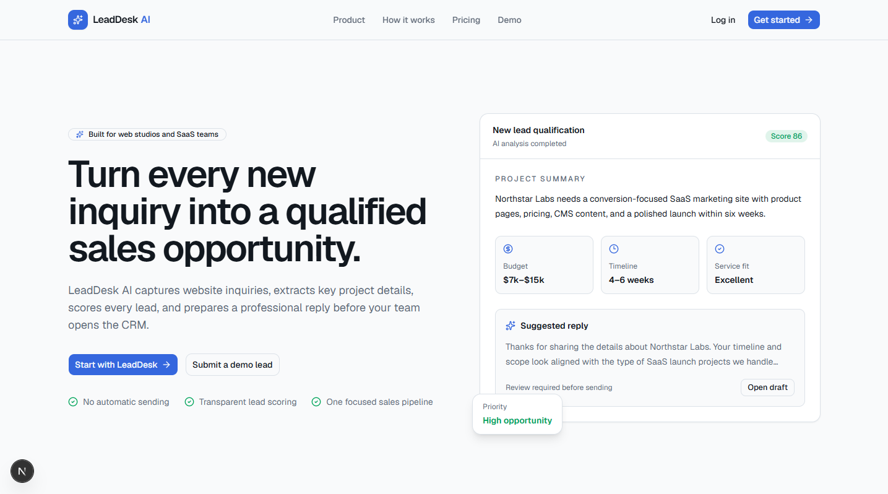

---

## Product overview

LeadDesk AI is a compact multi-tenant B2B CRM designed for web studios that receive website, e-commerce, web application, redesign, and SaaS MVP inquiries.

The application demonstrates a complete commercial SaaS workflow:

```text
Lead Capture
→ AI Qualification
→ Manager Review
→ Email Reply
→ Pipeline
→ Tasks
→ Analytics
→ Billing
```

The project was developed under a frozen Product Contract with a strict MVP boundary. It is intentionally not a universal CRM, project-management suite, helpdesk platform, or omnichannel communication system.

## Live application

**Production:** [lead-desk-ai.vercel.app](https://lead-desk-ai.vercel.app)

The portfolio deployment uses:

- Supabase hosted PostgreSQL and Auth;
- Vercel production deployment;
- mock or configured AI provider;
- mock or configured email provider;
- Stripe billing strictly in test mode.

No real payment is processed.

---

## Main capabilities

### Secure lead capture

A public form accepts project inquiries through a protected server endpoint.

The flow includes:

- Zod validation;
- string sanitization;
- honeypot protection;
- consent verification;
- rate limiting;
- field-length restrictions;
- server-resolved workspace identity;
- no direct anonymous insert access to the `leads` table.

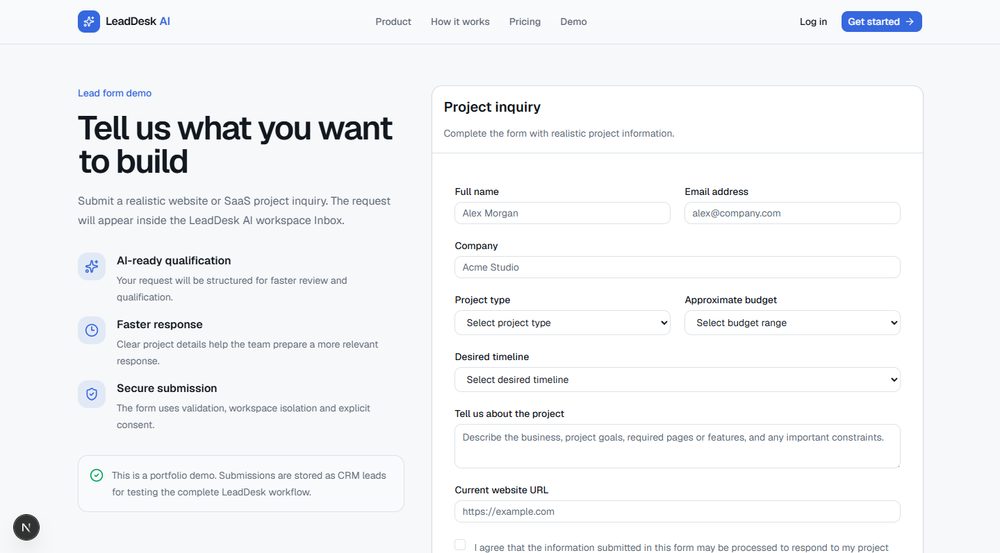

### Structured AI qualification

Each lead can be processed into a validated structured result containing:

- project summary;
- extracted services and business context;
- service-fit classification;
- urgency;
- completeness score;
- missing information;
- identified risks;
- transparent score breakdown;
- editable reply draft.

AI does not send email, change stages, assign managers, or make irreversible business decisions.

### Transparent lead scoring

Lead scores use six visible categories:

| Category | Maximum |
|---|---:|
| Budget | 25 |
| Timeline | 15 |
| Completeness | 20 |
| Service fit | 20 |
| Urgency | 10 |
| Description quality | 10 |
| **Total** | **100** |

The interface displays the score, its category breakdown, explanation, missing information, and risks. The score is a decision-support tool rather than a guarantee of conversion.

### Searchable lead inbox

The Inbox supports:

- search by name, email, company, and description;
- stage filtering;
- priority filtering;
- source filtering;
- AI-status filtering;
- service-fit filtering;
- sorting by date, score, and budget;
- server-side workspace isolation.

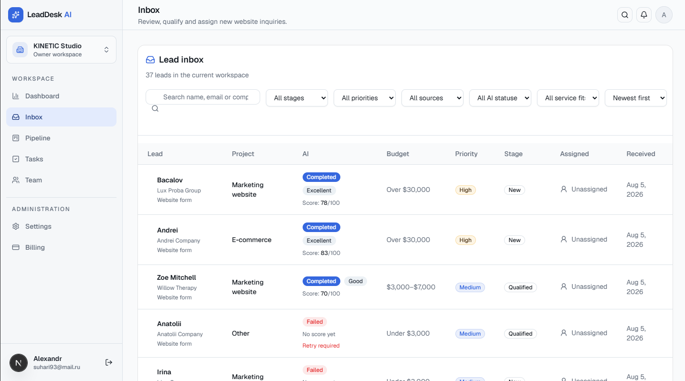

### Lead management

The lead detail page combines:

- contact information;
- submitted project request;
- estimated value;
- priority;
- assignee;
- current pipeline stage;
- qualification result;
- score breakdown;
- reply draft;
- notes;
- tasks;
- email history;
- append-only activity timeline.

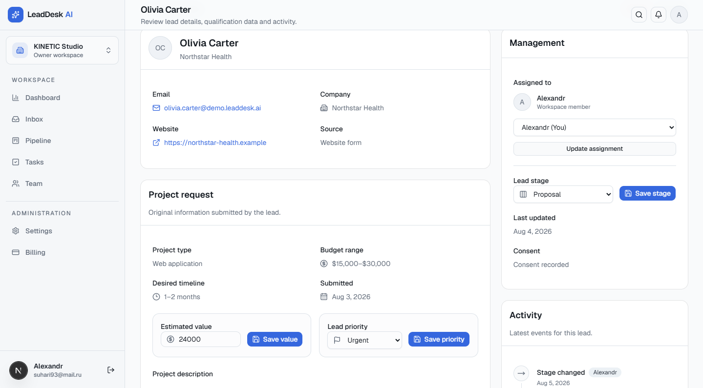

### Fixed sales pipeline

The pipeline contains six frozen stages:

1. New
2. Qualified
3. Contacted
4. Proposal
5. Won
6. Lost

It includes:

- drag-and-drop through `dnd-kit`;
- optimistic UI;
- persistence and rollback;
- stage history;
- lead counts;
- estimated pipeline value;
- mobile fallback.

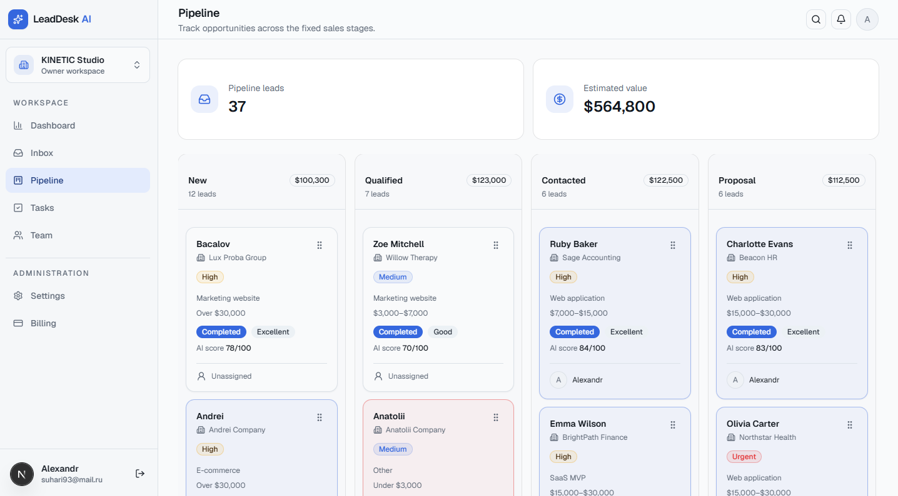

### Task management

Workspace users can:

- create tasks;
- edit tasks;
- assign tasks;
- connect tasks to leads;
- mark tasks Todo, In Progress, or Completed;
- filter by status and assignee;
- identify overdue work.

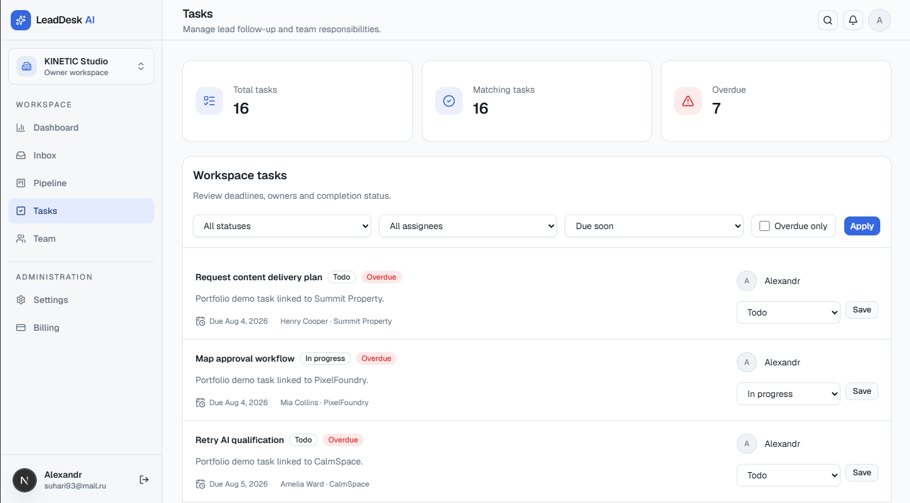

### Workspace and team management

LeadDesk AI uses a simple Owner and Member role model.

Owners can:

- manage workspace settings;
- upload the workspace logo;
- invite members;
- remove members;
- transfer ownership;
- manage billing.

Members can process leads, tasks, notes, drafts, email, and pipeline activity but cannot manage billing or workspace ownership.

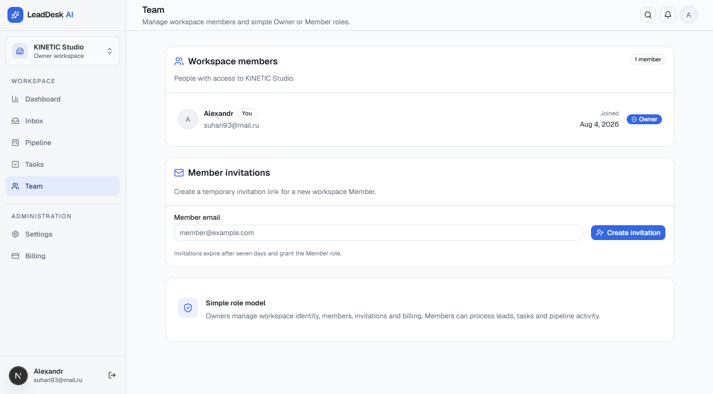

### Dashboard analytics

Dashboard metrics are calculated from workspace data:

- new leads;
- qualified leads;
- average score;
- conversion rate;
- open pipeline value;
- source distribution;
- stage distribution;
- first-response time;
- recent leads;
- upcoming and overdue tasks;
- AI and email health.

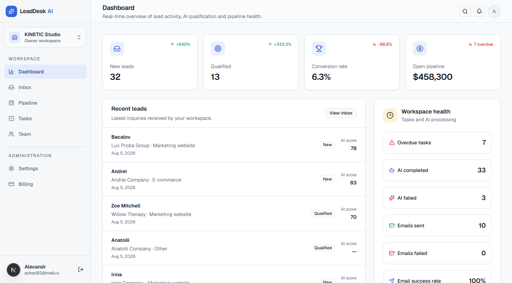

### Stripe test billing

Billing supports:

- Free, Pro, and Agency plans;
- hosted Stripe Checkout;
- Stripe Customer Portal;
- webhook signature verification;
- durable webhook idempotency;
- customer and subscription synchronization;
- Owner-only billing access;
- server-enforced Free-plan limits.

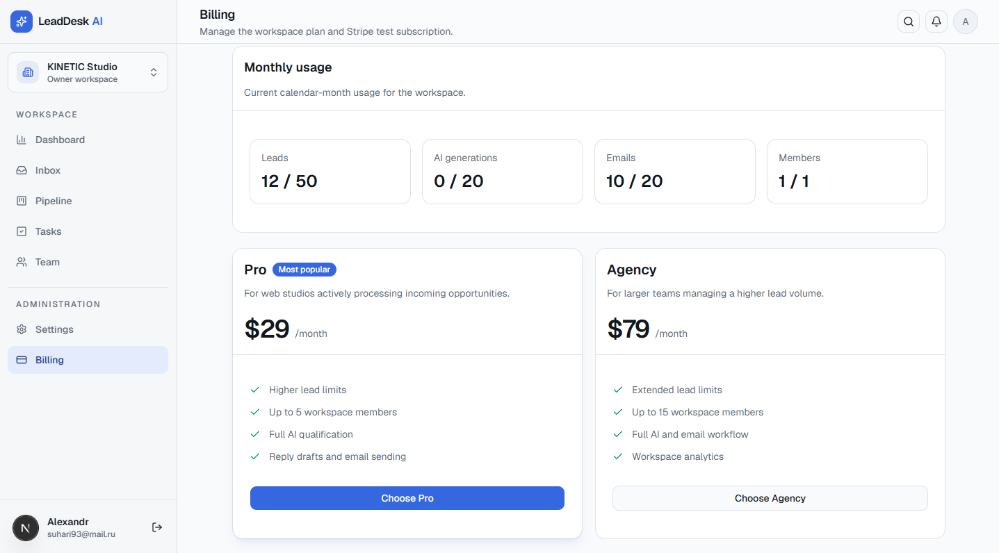

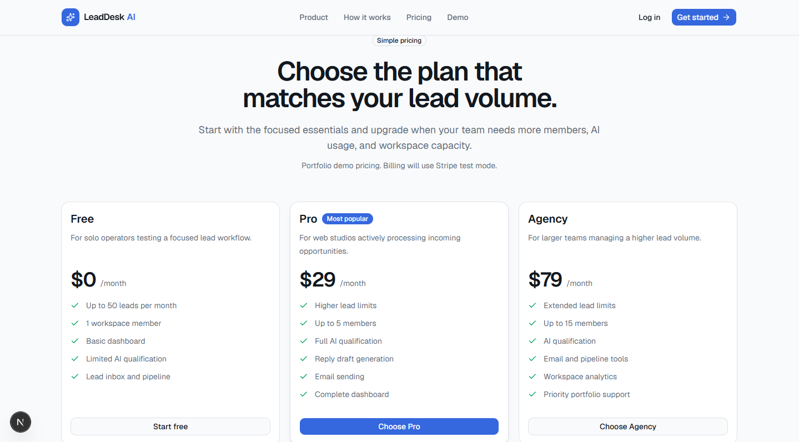

---

## Free-plan limits

The Free plan is enforced server-side:

| Resource | Monthly limit |
|---|---:|
| Leads | 50 |
| Workspace users | 1 |
| AI generations | 20 |
| Emails | 20 |

The browser cannot bypass these limits because enforcement is implemented in authenticated server logic and PostgreSQL functions.

---

## Architecture

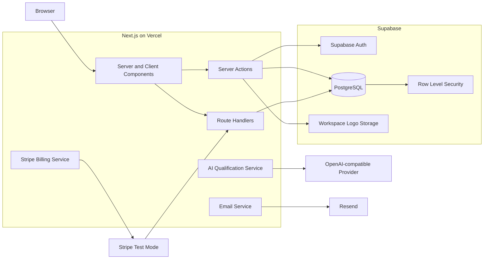

### Architectural principles

- Next.js Server Components by default;
- Client Components only for interactive areas;
- Server Actions for authenticated mutations;
- Route Handlers for public and provider endpoints;
- `workspace_id` on tenant-dependent data;
- Supabase RLS as a mandatory isolation layer;
- server-side role and membership checks;
- secrets available only in server environments;
- Stripe webhook as the billing source of truth;
- no microservices, queues, Redis, Kafka, CQRS, or unnecessary repository abstractions.

---

## Security model

### Multi-tenant isolation

A user may access a tenant resource only when a corresponding record exists in `workspace_members` for both:

```text
workspace_members.workspace_id = resource.workspace_id
workspace_members.user_id = auth.uid()
```

### Public lead form

Anonymous users never receive direct insert permission on `leads`.

Lead creation is performed through a server endpoint after:

- public form token validation;
- rate-limit checks;
- schema validation;
- consent validation;
- sanitization;
- honeypot validation.

### Service role

The Supabase server secret is used only for controlled server operations such as:

- public lead creation;
- Stripe webhook synchronization;
- trusted billing updates.

It is never included in the client bundle.

### Stripe webhook

The webhook handler:

- reads the raw request body;
- verifies the `stripe-signature`;
- rejects unverified payloads;
- stores Stripe event IDs for database-backed idempotency;
- synchronizes subscription and workspace plan state.

---

## Technology stack

### Application

- Next.js 16 App Router
- React 19
- TypeScript strict mode
- Tailwind CSS 4
- shadcn/ui
- Lucide React
- React Hook Form
- Zod

### Data and authentication

- Supabase PostgreSQL
- Supabase Auth
- Supabase Row Level Security
- Supabase Storage

### Product integrations

- OpenAI-compatible structured output
- Resend
- Stripe Node SDK
- dnd-kit
- Recharts

### Delivery

- Vercel
- ESLint
- Next.js type generation
- TypeScript compiler
- Supabase migrations

---

## Data model

The core entities are:

```text
auth.users
└── profiles

workspaces
├── workspace_members
├── workspace_invitations
├── subscriptions
├── leads
│   ├── lead_qualifications
│   ├── lead_reply_drafts
│   ├── lead_notes
│   ├── tasks
│   ├── lead_activities
│   └── lead_email_deliveries
└── workspace logo storage
```

All identifiers use UUIDs. Tenant-dependent tables contain `workspace_id`, and temporal fields use PostgreSQL timestamps with timezone.

---

## Application routes

### Public

| Route | Purpose |
|---|---|
| `/` | Product landing page |
| `/pricing` | Free, Pro, and Agency plans |
| `/demo` | Public lead form |
| `/login` | Authentication |
| `/register` | Owner registration and workspace creation |
| `/forgot-password` | Password recovery |
| `/reset-password` | New password |
| `/invite/[token]` | Workspace invitation |

### Application

| Route | Purpose |
|---|---|
| `/app` | Dashboard |
| `/app/inbox` | Lead inbox |
| `/app/pipeline` | Sales pipeline |
| `/app/leads/[leadId]` | Lead qualification and management |
| `/app/tasks` | Workspace tasks |
| `/app/team` | Members and invitations |
| `/app/settings` | Profile and company settings |
| `/app/billing` | Plan, usage, Checkout, and Portal |

### Server endpoints

| Endpoint | Purpose |
|---|---|
| `POST /api/public/leads` | Secure lead creation |
| `POST /api/leads/[id]/qualify` | AI qualification |
| `POST /api/leads/[id]/send-email` | Reviewed email delivery |
| `POST /api/stripe/checkout` | Stripe Checkout |
| `POST /api/stripe/portal` | Customer Portal |
| `POST /api/webhooks/stripe` | Verified Stripe synchronization |

Authenticated CRUD is also implemented with Next.js Server Actions.

---

## Portfolio demo data

The repository includes an idempotent portfolio seed:

```text
supabase/demo-seed.sql
```

It creates:

- 30 realistic demo leads;
- all six pipeline stages;
- 28 structured qualifications;
- 28 reply drafts;
- 15 tasks;
- 15 notes;
- activity histories;
- successful email delivery records;
- pending and failed AI examples.

The seed only replaces leads using the domain:

```text
@demo.leaddesk.ai
```

Existing non-demo leads remain untouched.

---

## Local development

### Requirements

- Node.js 22 or newer
- npm
- Supabase project
- Supabase CLI
- Stripe test account for billing flows
- OpenAI API access only when using the real provider
- Resend account only when using the real email provider

### Installation

```bash
git clone https://github.com/SuhihAlex/LeadDesk-AI.git
cd LeadDesk-AI
npm install
```

Copy the environment template:

```bash
cp .env.example .env.local
```

PowerShell:

```powershell
Copy-Item .env.example .env.local
```

Apply migrations to the linked Supabase project:

```bash
npx supabase migration list
npx supabase db push
```

Start development:

```bash
npm run dev
```

Open:

```text
http://localhost:3000
```

---

## Environment variables

```dotenv
# Public Supabase configuration
NEXT_PUBLIC_SUPABASE_URL=
NEXT_PUBLIC_SUPABASE_PUBLISHABLE_KEY=

# Server-only Supabase configuration
SUPABASE_SECRET_KEY=

# Demo public lead form
NEXT_PUBLIC_DEMO_FORM_TOKEN=

# Application
NEXT_PUBLIC_SITE_URL=http://localhost:3000

# AI qualification
AI_PROVIDER=mock
OPENAI_API_KEY=
OPENAI_MODEL=gpt-4.1-mini

# Email delivery
EMAIL_PROVIDER=mock
RESEND_API_KEY=
EMAIL_FROM=
EMAIL_REPLY_TO=

# Stripe test-mode billing
STRIPE_SECRET_KEY=
STRIPE_WEBHOOK_SECRET=
STRIPE_PRO_PRICE_ID=
STRIPE_AGENCY_PRICE_ID=
```

For development without paid external providers:

```dotenv
AI_PROVIDER=mock
EMAIL_PROVIDER=mock
```

Secrets must never use the `NEXT_PUBLIC_` prefix.

---

## Validation

Run before every release:

```bash
npm run lint
npm run typecheck
npm run build
git diff --check
```

A release is not accepted until all validation commands pass.

---

## Product constraints

The Product Contract is frozen.

The current MVP intentionally excludes:

- custom pipeline stages;
- custom fields;
- multiple workspaces per user;
- incoming email synchronization;
- email sequences;
- WhatsApp, Telegram, or social integrations;
- calls and telephony;
- file attachments;
- proposal generation;
- invoices and production payments;
- workflow builders;
- public API;
- autonomous agents;
- mobile applications;
- enterprise SSO.

The complete contract is available in:

```text
docs/product-contract.md
```

---

## Project status

LeadDesk AI v1.0 includes:

- completed end-to-end business flow;
- production deployment on Vercel;
- hosted Supabase database and authentication;
- reproducible migrations;
- multi-tenant RLS;
- structured AI qualification;
- email workflow;
- fixed-stage pipeline;
- tasks and analytics;
- Stripe test billing;
- workspace member management;
- workspace logo storage;
- realistic portfolio demo data;
- production screenshots.

New product functionality is frozen. Further changes are limited to critical fixes and portfolio presentation materials.

---

## Author

Built by **Alex Suhih** as a commercial SaaS portfolio project for **KINETIC Studio**.